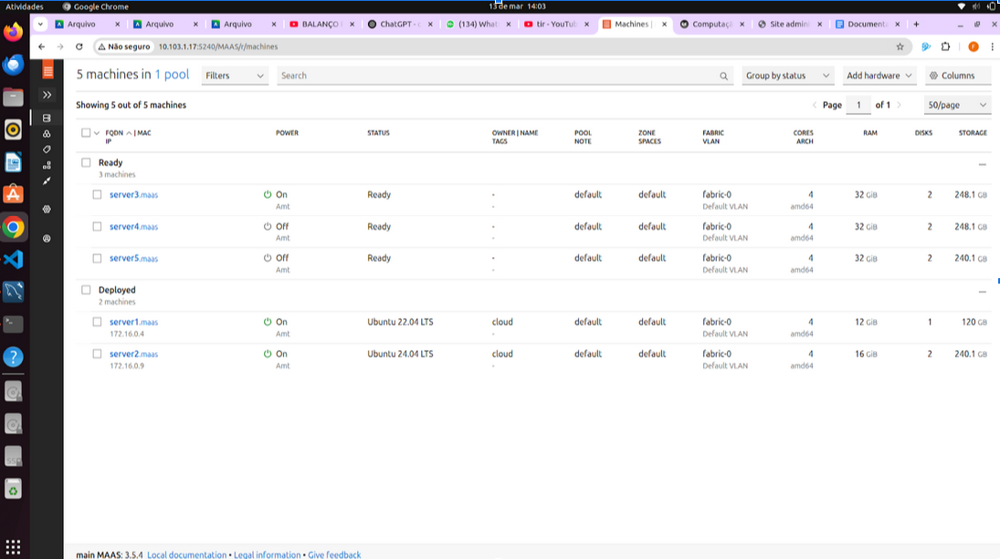
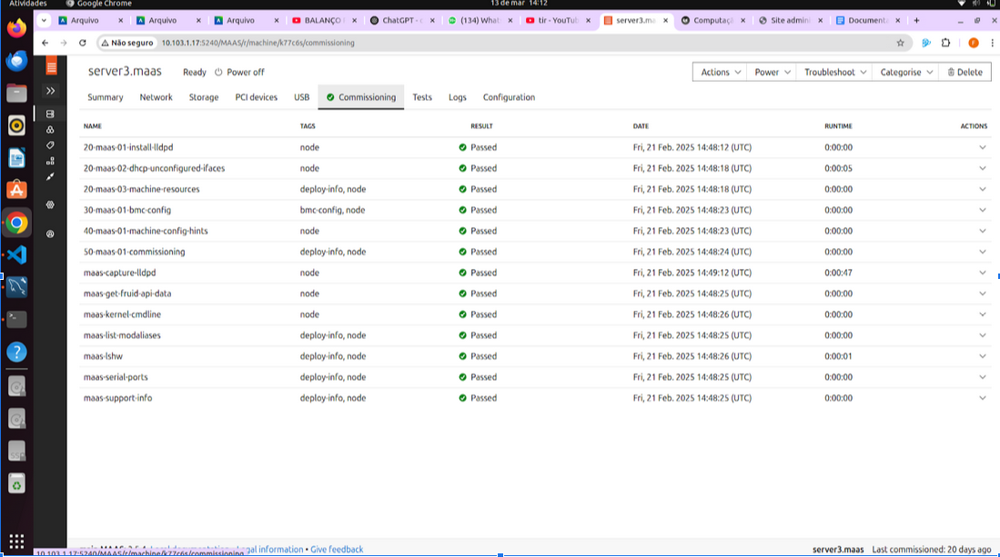

## Objetivo

Este Roteiro tem o objetivo a documentação e implementação de conceitos sobre uma plataforma de gerenciamento de hardware

## Montagem do Roteiro


### Tarefa 1

Instalando o MAAS:

<!-- termynal -->

``` bash
sudo snap install maas --channel=3.5/Stable
```


 caption
Dashboard do MAAS


Conforme ilustrado acima, a tela inicial do MAAS apresenta um dashboard com informações sobre o estado atual dos servidores gerenciados. O dashboard é composto por diversos painéis, cada um exibindo informações sobre um aspecto específico do ambiente gerenciado. Os painéis podem ser configurados e personalizados de acordo com as necessidades do usuário.

### 1. Verificar se está funcionando e se o status está ativo.


### 2.Verificar acessibilidade na própria máquina: 


O comando: psql -U cloud -h 172.16.0.4 tasks. Faz o seguinte:
psql: Inicia o cliente interativo do PostgreSQL.
-U cloud: Específica o usuário do banco de dados, que no caso é cloud.
-h 172.16.0.4: Define o host (endereço IP) do servidor PostgreSQL ao qual você deseja se conectar. Neste caso, a conexão será feita para o IP 172.16.0.4, que pode ser um outro servidor na rede ou até mesmo o próprio servidor se esse for o IP dele.
tasks: Define o nome do banco de dados ao qual o usuário cloud tentará se conectar.
Esse código foi executado dentro do Server1.
Abaixo uma imagem da conexão bem sucedida: 


### 3. Acessibilidade a partir da máquina main: 

 
Usando o mesmo comando para verificar a conexão interna, porém agora a partir da minha máquina main. 
Instalei o client na main usando o comando:
sudo apt update && sudo apt install postgresql-client -y


### 4. Porta em que o serviço está funcionando:

 
Ao executar o nmap. Foi conferido que o serviço está rodando na porta 5432:
5432/tcp open postgresql


### Tarefa 2

### 1.Do Dashboard do **MAAS** com as máquinas.


### 2.Da aba de imagens, com as imagens sincronizadas


### 3. Cada máquina
### máquina 1:


### máquina 2:


### máquina 3:



### máquina 4:


### máquina 5:

  

### Tarefa 3

### 1.máquinas e respectivos IPs
  

### 2.Aplicação Django
  

### 3. Explicação da aplicação manual do Django:
 
a. Deploy feito pelo dashboard do maas - deploy por linha de comando não estava funcionando

b. No ssh do server2 foi clonado o seguinte repositório: 

git clone https://github.com/raulikeda/tasks.git

c. dentro do diretorio tasks. Foi feita a instalação

./install.sh 

d. reboot do server2

sudo reboot

e. testando o acesso:

wget http://[IP server2]:8080/admin/

f. Ao testar o acesso obtivemos erros de conexão:

mudança no etc/hosts

172.16.0.4 server1 (onde estava instalado o postgres)

g. Tunel ssh:

conectanmos no maas utilizando: ssh cloud@10.103.0.X -L 8001:[IP server2]:8080

h. acesso no django feito: 

user: cloud

senha: cloud


Exemplo de diagrama


[Mermaid](https://mermaid.js.org/syntax/architecture.html){:target="_blank"}

## Questionário, Projeto ou Plano

Esse seção deve ser preenchida apenas se houver demanda do roteiro.

## Discussões

Quais as dificuldades encontradas? O que foi mais fácil? O que foi mais difícil?

## Conclusão

O que foi possível concluir com a realização do roteiro?
