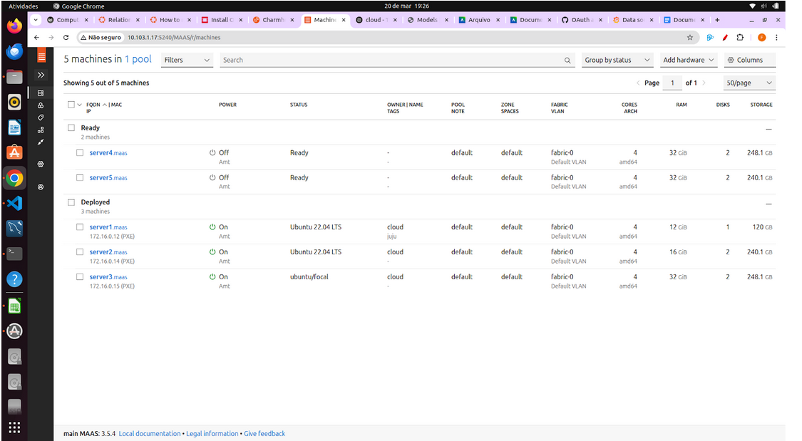

## Objetivo

Este Roteiro tem o objetivo a documentação e implementação de conceitos sobre uma plataforma de gerenciamento de software e a comunicação entre aplicativos e serviços

### Tarefa 1

### 1. De um print da tela do Dashboard do MAAS com as Maquinas e seus respectivos IPs.

### 2. De um print de tela do comando "juju status" depois que o Grafana estiver "active". 

Status do Controller: 

Status do openstack: 

### 3. De um print da tela do Dashboard do Grafana com o Prometheus aparecendo como source.

Acessado a partir de um tunelamento. Isso foi feito apos a integração com o grafana:

### 4. Prove (print) que você está conseguindo acessar o Dashboard a partir da rede do Insper.

### 5. De um print na tela que mostra as aplicações sendo gerenciadas pelo JUJU

Dashboard do JUJU - models: 

Dashboard do JUJU - controlers: 

### Extra:
Foi criado uma regra de NAT para o dashboard do JUJU - facilitar o acesso e evitar tunelamento:

