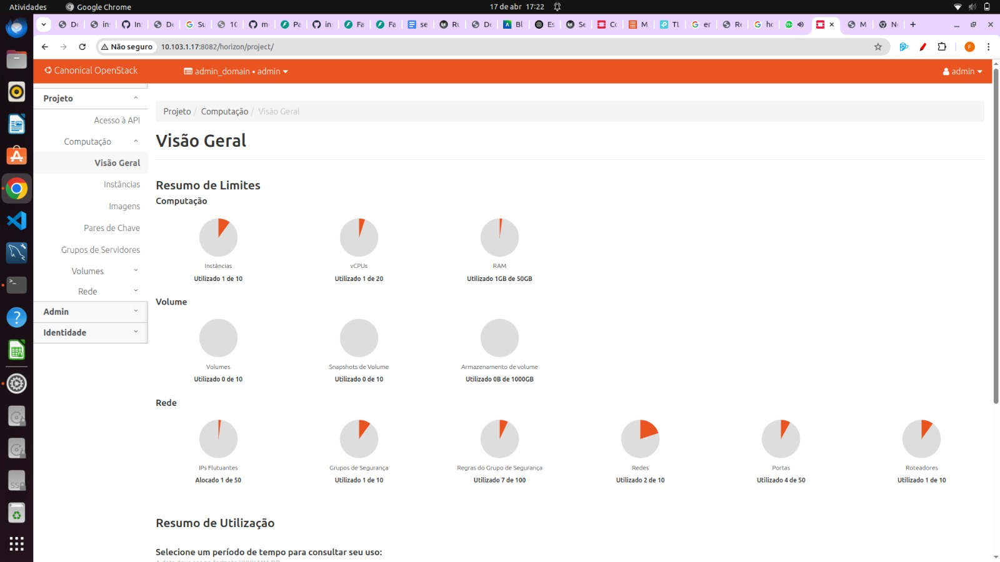

## Objetivo

Este Roteiro tem o objetivo a documentação e implementação de conceitos básicos sobre private cloud e o aprofundamentro de conceitos de redes virtuais com SDN

### Tarefa 1

### 1. De um print das Telas abaixo:

### a. Do Status do JUJU

### b. Do Dashboard do MAAS com as máquinas.

### c. Da aba compute overview no OpenStack Dashboard.

### d. Da aba compute instances no OpenStack Dashboard.

### e. Da aba network topology no OpenStack Dashboard.

### Tarefa 2

### 1. De um print das Telas abaixo:

### a. Do Dashboard do MAAS com as máquinas.

### B. Da aba compute overview no OpenStack.

### c. Da aba compute instances no OpenStack.

### d. Da aba network topology no OpenStack.

### 2. Enumere as diferencas encontradas entre os prints das telas na Tarefa 1 e na Tarefa 2.

### a. Instâncias

Tarefa 1: Não há nenhuma instância criada (tela "Instâncias" vazia).

Tarefa 2: Existe uma instância ativa chamada "client", com IPs atribuídos (192.169.0.136, 172.16.8.69).

### b. Topologia de Rede

Tarefa 1: A topologia está vazia, sem redes, roteadores ou instâncias visíveis.

Tarefa 2: A topologia mostra:

    Um roteador ativo,

    Duas redes (ex: Internal_net),

    E a instância "client" conectada à rede.

### c. Visão Geral do Projeto

Tarefa 1: Todos os recursos (instâncias, vCPUs, RAM, redes, roteadores etc.) estão com uso zerado.

Tarefa 2: Diversos recursos estão em uso:

    1 de 10 instâncias,

    1 vCPU,

    1GB de RAM,

    2 redes, 1 roteador, 4 portas, 7 regras de segurança, 1 IP flutuante etc.

### d. MAAS — Estado das Máquinas

Tarefa 1: Apenas 4 máquinas estão em estado "Deployed", uma está "Ready" (server2).

Tarefa 2: 5 máquinas estão "Deployed" (inclusive server2.maas), ou seja, mais uma máquina foi provisionada desde a tarefa anterior.

### 3. Explique como cada recurso foi criado. 

### Tarefa 3

### 1. Faça um desenho de como é a sua arquitetura de rede, desde a sua conexão com o Insper até a instância alocada.

### Tarefa 4.

### 1. Escreva um relatório dos passos utilizados. (Coloque em uma seção do material a ser entregue do roteiro - MkDocs!!!!!!!)

### 2. Anexe fotos e/ou diagramas contendo: arquitetura de rede da sua infraestrutura dentro do Dashboard do Openstack 

### 3. Lista de VMs utilizadas com nome e IPs alocados

### 4. Print do Dashboard do Wordpress conectado via máquina Nginx/LB.

### 5. 4 Prints, cada um demonstrando em qual server (máquina fisica) cada instância foi alocado pelo OpenStack. 

### Discussões:

A instalação do Juju e sua integração com o MaaS foram relativamente tranquilas após entender a lógica de providers e credenciais. O uso do juju bootstrap para configurar o controlador exigiu atenção às tags e série correta, mas funcionou bem após a preparação. O deploy dos charms do Grafana e Prometheus foi direto, mas a integração entre eles demandou leitura cuidadosa da documentação. O acesso ao Dashboard do Grafana e a validação do Prometheus como source exigiram configuração de túnel SSH ou NAT, o que foi um ponto mais técnico. No geral, o Juju facilitou bastante o gerenciamento dos serviços distribuídos, embora o entendimento inicial da ferramenta tenha exigido um pouco mais de estudo.

### Conclusão:
O uso do Juju mostrou-se uma poderosa ferramenta de orquestração de serviços, especialmente por sua integração direta com o MaaS, permitindo deploys consistentes e escaláveis em infraestrutura bare-metal. Comparado ao Ansible, Juju vai além, assumindo também o provisionamento das máquinas. A abordagem baseada em charms simplificou o deploy do Grafana e Prometheus, e o dashboard do Juju ofereceu uma visão clara das aplicações em execução
